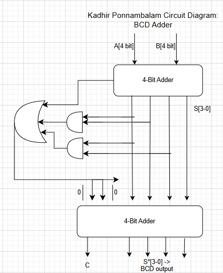
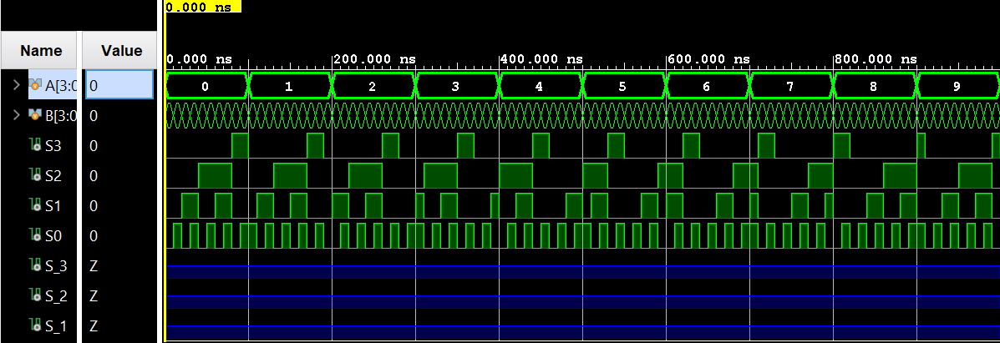

## BCD Adder (Binary Coded Decimal) \| Verilog

A Verilog implementation of a **4-bit Binary Coded Decimal (BCD) adder**, developed with the Vivado IDE. This document explains what BCD is, why simple binary addition is not sufficient for decimal digits, how the **“add 6” correction** works, derives the **correction logic equation**, and summarizes the circuit, waveform, and simulation results.

---

## Table of Contents

- [What Is a BCD Adder?](#what-is-a-bcd-adder)
- [BCD Addition Theory: Why Correction?](#bcd-addition-theory-why-correction)
- [Binary Sum to BCD Sum Conversion](#binary-sum-to-bcd-sum-conversion)
- [Correction Logic and Boolean Equations](#correction-logic-and-boolean-equations)
- [4-Bit BCD Adder Architecture](#4-bit-bcd-adder-architecture)
- [Learning Resources](#learning-resources)
- [Circuit Diagram](#circuit-diagram)
- [Waveform Diagram](#waveform-diagram)
- [Testbench Output](#testbench-output)
- [Running the Project in Vivado](#running-the-project-in-vivado)
- [Project Files](#project-files)

---

## What Is a BCD Adder?

A **BCD adder** is a combinational circuit that adds **two decimal digits encoded in BCD** (Binary Coded Decimal). Each decimal digit 0–9 is represented by a 4-bit binary pattern.

- **BCD digit encoding**
  - 0 → `0000`
  - 1 → `0001`
  - …
  - 9 → `1001`
  - `1010`–`1111` are **invalid** BCD codes for a single digit.

- **Inputs**
  - **A** = A<sub>3</sub>A<sub>2</sub>A<sub>1</sub>A<sub>0</sub> — BCD digit 0–9.
  - **B** = B<sub>3</sub>B<sub>2</sub>B<sub>1</sub>B<sub>0</sub> — BCD digit 0–9.
  - (Optional) **C<sub>in</sub>** — incoming decimal carry (0 or 1). In this design the testbench uses C<sub>in</sub> = 0.

- **Outputs**
  - **BCD\_Sum** = S<sub>3</sub>S<sub>2</sub>S<sub>1</sub>S<sub>0</sub> — one BCD digit 0–9.
  - **C** — carry indicating the decimal **tens** digit (0 or 1).

Because each input is a decimal digit 0–9, the numeric sum **A + B** ranges from 0 to 18. The BCD adder must therefore:

- Produce a BCD sum digit 0–9 (S<sub>3</sub>S<sub>2</sub>S<sub>1</sub>S<sub>0</sub>), and  
- Produce a carry **C** that represents the **tens** part of the decimal result (0 or 1).

---

## BCD Addition Theory: Why Correction?

If we simply add the 4-bit inputs **A** and **B** as ordinary binary numbers, we get a **binary sum** in the range 0–18:

- Minimum: 0 + 0 = 0 (binary `0000`)
- Maximum: 9 + 9 = 18 (binary `10010`, represented as 5 bits)

However, a single BCD digit must stay in the range **0000–1001**. For results above 9, the raw binary sum is **not** a valid BCD digit and must be **corrected**.

Conceptually:

- For sums **0–9**: the **binary sum equals the BCD sum**.
- For sums **10–18**: the 4-bit binary sum must be **converted** to the correct BCD digit and a **carry** must be generated to represent the extra “ten”.

The standard method is:

- **Compute the 4-bit binary sum first** (using a normal binary adder).
- **Detect when this binary result is greater than 9** or when it caused a carry.
- **Add 6 (0110) to the binary result** when correction is needed.
- The output of this second addition is a **valid BCD digit**, and the carry is the **tens** digit.

---

## Binary Sum to BCD Sum Conversion

Let:

- S\* = S<sub>3*</sub>S<sub>2*</sub>S<sub>1*</sub>S<sub>0*</sub> be the **4-bit binary sum** of A and B (before BCD correction).
- C\* be the carry from this first binary addition.

Together, **C\*** and **S\*** represent a value from 0 to 18. The goal is to convert this into:

- Final BCD digit S<sub>3</sub>S<sub>2</sub>S<sub>1</sub>S<sub>0</sub> (0–9), and
- Decimal carry **C** (0 or 1).

The key property used in BCD adders is:

- For sums **0–9** (decimal), the **binary sum equals the BCD sum**.
- For sums **10–18** (decimal), the **correct BCD result** is obtained by adding **6 (0110)** to the 4-bit binary sum.

**Example (sum = 10):**

- A = 9 → `1001`  
- B = 1 → `0001`  
- Raw binary sum S\* = `1001` + `0001` = `1010` (decimal 10), C\* = 0.  
- Add 6 (0110): `1010` + `0110` = `0000` with carry 1.  
- Result: **C = 1**, BCD\_Sum = `0000` → decimal 10 (1×10 + 0).

Thus, if we detect that the raw result is **invalid as a single BCD digit**, we **add 6 (0110)** to S\* to obtain a valid BCD digit and a carry.

---

## Correction Logic and Boolean Equations

We now derive the logic that decides **when** to add 6. This is done via a **correction signal** that becomes 1 exactly when the binary result exceeds 9 (or when C\* indicates a higher value).

Let:

- S<sub>3*</sub>, S<sub>2*</sub>, S<sub>1*</sub>, S<sub>0*</sub> be the bits of the **uncorrected binary sum**.
- C\* be the carry out of the first 4-bit binary adder.
- Logical operators:
  - **“·”** means **AND**.
  - **“+”** means **OR**.

From the BCD correction rules:

- When **C\* = 1**, the overall sum is at least 16 → correction is needed (we must add 6).
- When C\* = 0, correction is needed if the 4-bit sum S\* is **greater than 9** (i.e., decimal 10–15 for a single-digit adder with no incoming carry).

A standard detection condition (derived from the truth table of S\*) is:

- Correction needed when:

  - **C\* = 1** (covers sums 16–18), or  
  - **S<sub>3*</sub> = 1 and S<sub>2*</sub> = 1** (covers 12–15), or  
  - **S<sub>3*</sub> = 1 and S<sub>1*</sub> = 1** (covers 10–11).

Putting this into Boolean form:

- **Correction signal** = C<sub>corr</sub> =  
  C\* + S<sub>3*</sub>·S<sub>2*</sub> + S<sub>3*</sub>·S<sub>1*</sub>

This is the equation you derived:

- Start with the condition:

  - “When C\* = 1, we need to add 6” (cases 16–18), and
  - “When S<sub>3*</sub> & (S<sub>2*</sub> + S<sub>1*</sub>) = 1, we need to add 6” (cases 10–15).

- Expand:

  - C<sub>corr</sub> = C\* + S<sub>3*</sub>·(S<sub>2*</sub> + S<sub>1*</sub>)  
  - C<sub>corr</sub> = C\* + S<sub>3*</sub>·S<sub>2*</sub> + S<sub>3*</sub>·S<sub>1*</sub>

So the **final correction equation** is:

- **C<sub>corr</sub> = C\* + S<sub>3*</sub>·S<sub>2*</sub> + S<sub>3*</sub>·S<sub>1*</sub>**

When **C<sub>corr</sub> = 1**, we must **add 6 (0110)** to the 4-bit binary sum S\*.

To implement “add 6” using standard gates:

- Build a 4-bit value **K** whose bits are:

  - K<sub>3</sub> = 0  
  - K<sub>2</sub> = C<sub>corr</sub>  
  - K<sub>1</sub> = C<sub>corr</sub>  
  - K<sub>0</sub> = 0  

  This encodes either **0 (0000)** when C<sub>corr</sub> = 0, or **6 (0110)** when C<sub>corr</sub> = 1.

- Add **K** to the 4-bit binary sum S\* with a second 4-bit adder.

The **final outputs** are then:

- Final BCD sum: S = S<sub>3</sub>S<sub>2</sub>S<sub>1</sub>S<sub>0</sub> = S\* + K (4-bit result of the second adder).  
- Decimal carry: **C = C<sub>corr</sub>**, which is also the carry-out of the second adder.

---

## 4-Bit BCD Adder Architecture

The full 4-bit BCD adder is implemented as a **two-stage structure**:

- **Stage 1 — 4-bit binary adder**
  - Inputs: A[3:0], B[3:0].
  - Outputs:
    - S\*[3:0] = S<sub>3*</sub>S<sub>2*</sub>S<sub>1*</sub>S<sub>0*</sub> — 4-bit binary sum.
    - C\* — binary carry-out.

- **Stage 2 — BCD correction block**
  - Inputs: S\*[3:0], C\*.
  - Internal logic:
    - Computes the correction signal:

      - C<sub>corr</sub> = C\* + S<sub>3*</sub>·S<sub>2*</sub> + S<sub>3*</sub>·S<sub>1*</sub>

    - Forms the “add 6 or 0” vector:

      - K[3:0] = {0, C<sub>corr</sub>, C<sub>corr</sub>, 0} → either `0000` or `0110`.

    - Adds K[3:0] to S\*[3:0] using another 4-bit adder.

- **Final outputs**
  - **BCD\_Sum[3:0]** = corrected 4-bit BCD digit after adding K.
  - **C** = C<sub>corr</sub> — decimal carry (tens digit of the result).

This architecture **demonstrates**:

- Understanding of **BCD encoding**.
- Application of **binary addition** as an intermediate step.
- Design of **correction logic** based on Boolean equations.
- Use of a **second adder** to implement the “+6 when needed” correction.

---

## Learning Resources

| Resource | Description |
|----------|-------------|
| [BCD Adder Basics (YouTube)](https://www.youtube.com/results?search_query=bcd+adder) | Introduces BCD representation and the concept of adding 6 for correction. |
| [Binary Coded Decimal Explained (YouTube)](https://www.youtube.com/results?search_query=binary+coded+decimal+explained) | Detailed explanation of BCD encoding and valid/invalid codes. |
| [Design of BCD Adder (YouTube)](https://www.youtube.com/results?search_query=design+of+bcd+adder+verilog) | Step-by-step BCD adder design, truth tables, and Verilog examples. |
| [Verilog Adders and Combinational Logic (YouTube)](https://www.youtube.com/results?search_query=verilog+adder+combinational+logic) | Shows how to implement adders and logic equations in Verilog and build testbenches. |

---

## Circuit Diagram

The circuit contains:

- A first **4-bit binary adder** that computes S\*[3:0] and C\*.
- Logic gates that implement the correction equation:

  - C<sub>corr</sub> = C\* + S<sub>3*</sub>·S<sub>2*</sub> + S<sub>3*</sub>·S<sub>1*</sub>

- Simple wiring to form the “add 6” vector K[3:0] = {0, C<sub>corr</sub>, C<sub>corr</sub>, 0}.
- A second **4-bit binary adder** that adds S\*[3:0] and K[3:0] to produce BCD\_Sum[3:0].
- The correction signal **C<sub>corr</sub>** is also used as the final carry **C**.

You can reference a schematic like:



*(Update the image path/name as appropriate for your project.)*

---

## Waveform Diagram

The behavioral simulation waveform shows:

- A[3:0] and B[3:0] cycling through all combinations that represent decimal 0–9.
- The intermediate binary sum S\*[3:0] and C\* (if probed).
- The correction signal C<sub>corr</sub>.
- The final outputs:
  - **C** (decimal carry),
  - **BCD\_Sum[3:0]** (valid BCD digit 0–9).

For each input pair (A, B), the waveform confirms that the outputs correspond to the **correct decimal sum**, expressed as:

- Decimal value = C × 10 + value(BCD\_Sum)

Example waveform illustration:



*(Update the image path/name as appropriate for your project.)*

---

## Testbench Output

The testbench applies a range of valid BCD combinations for A and B (0–9) with **C<sub>in</sub> = 0**, and prints the inputs and outputs:

- **A** — BCD-encoded decimal digit (0000–1001)
- **B** — BCD-encoded decimal digit (0000–1001)
- **C** — decimal carry (0 or 1)
- **BCD\_Sum** — corrected BCD sum digit (0000–1001)

A representative portion of the simulation log is shown below. Because the output is long, it appears inside a **scrollable code block**.

<details>
<summary>Click to expand full testbench output (scrollable)</summary>

```text
A = 0000, B = 0000 | C = 0, BCD_Sum = 0000
A = 0000, B = 0001 | C = 0, BCD_Sum = 0001
A = 0000, B = 0010 | C = 0, BCD_Sum = 0010
A = 0000, B = 0011 | C = 0, BCD_Sum = 0011
A = 0000, B = 0100 | C = 0, BCD_Sum = 0100
A = 0000, B = 0101 | C = 0, BCD_Sum = 0101
A = 0000, B = 0110 | C = 0, BCD_Sum = 0110
A = 0000, B = 0111 | C = 0, BCD_Sum = 0111
A = 0000, B = 1000 | C = 0, BCD_Sum = 1000
A = 0000, B = 1001 | C = 0, BCD_Sum = 1001
A = 0001, B = 0000 | C = 0, BCD_Sum = 0001
A = 0001, B = 0001 | C = 0, BCD_Sum = 0010
A = 0001, B = 0010 | C = 0, BCD_Sum = 0011
A = 0001, B = 0011 | C = 0, BCD_Sum = 0100
A = 0001, B = 0100 | C = 0, BCD_Sum = 0101
A = 0001, B = 0101 | C = 0, BCD_Sum = 0110
A = 0001, B = 0110 | C = 0, BCD_Sum = 0111
A = 0001, B = 0111 | C = 0, BCD_Sum = 1000
A = 0001, B = 1000 | C = 0, BCD_Sum = 1001
A = 0001, B = 1001 | C = 1, BCD_Sum = 0000
A = 0010, B = 0000 | C = 0, BCD_Sum = 0010
A = 0010, B = 0001 | C = 0, BCD_Sum = 0011
A = 0010, B = 0010 | C = 0, BCD_Sum = 0100
A = 0010, B = 0011 | C = 0, BCD_Sum = 0101
A = 0010, B = 0100 | C = 0, BCD_Sum = 0110
A = 0010, B = 0101 | C = 0, BCD_Sum = 0111
A = 0010, B = 0110 | C = 0, BCD_Sum = 1000
A = 0010, B = 0111 | C = 0, BCD_Sum = 1001
A = 0010, B = 1000 | C = 1, BCD_Sum = 0000
A = 0010, B = 1001 | C = 1, BCD_Sum = 0001
A = 0011, B = 0000 | C = 0, BCD_Sum = 0011
A = 0011, B = 0001 | C = 0, BCD_Sum = 0100
A = 0011, B = 0010 | C = 0, BCD_Sum = 0101
A = 0011, B = 0011 | C = 0, BCD_Sum = 0110
A = 0011, B = 0100 | C = 0, BCD_Sum = 0111
A = 0011, B = 0101 | C = 0, BCD_Sum = 1000
A = 0011, B = 0110 | C = 0, BCD_Sum = 1001
A = 0011, B = 0111 | C = 1, BCD_Sum = 0000
A = 0011, B = 1000 | C = 1, BCD_Sum = 0001
A = 0011, B = 1001 | C = 1, BCD_Sum = 0010
A = 0100, B = 0000 | C = 0, BCD_Sum = 0100
A = 0100, B = 0001 | C = 0, BCD_Sum = 0101
A = 0100, B = 0010 | C = 0, BCD_Sum = 0110
A = 0100, B = 0011 | C = 0, BCD_Sum = 0111
A = 0100, B = 0100 | C = 0, BCD_Sum = 1000
A = 0100, B = 0101 | C = 0, BCD_Sum = 1001
A = 0100, B = 0110 | C = 1, BCD_Sum = 0000
A = 0100, B = 0111 | C = 1, BCD_Sum = 0001
A = 0100, B = 1000 | C = 1, BCD_Sum = 0010
A = 0100, B = 1001 | C = 1, BCD_Sum = 0013
A = 0101, B = 0000 | C = 0, BCD_Sum = 0101
A = 0101, B = 0001 | C = 0, BCD_Sum = 0110
A = 0101, B = 0010 | C = 0, BCD_Sum = 0111
A = 0101, B = 0011 | C = 0, BCD_Sum = 1000
A = 0101, B = 0100 | C = 0, BCD_Sum = 1001
A = 0101, B = 0101 | C = 1, BCD_Sum = 0000
A = 0101, B = 0110 | C = 1, BCD_Sum = 0001
A = 0101, B = 0111 | C = 1, BCD_Sum = 0010
A = 0101, B = 1000 | C = 1, BCD_Sum = 0011
A = 0101, B = 1001 | C = 1, BCD_Sum = 0100
A = 0110, B = 0000 | C = 0, BCD_Sum = 0110
A = 0110, B = 0001 | C = 0, BCD_Sum = 0111
A = 0110, B = 0010 | C = 0, BCD_Sum = 1000
A = 0110, B = 0011 | C = 0, BCD_Sum = 1001
A = 0110, B = 0100 | C = 1, BCD_Sum = 0000
A = 0110, B = 0101 | C = 1, BCD_Sum = 0001
A = 0110, B = 0110 | C = 1, BCD_Sum = 0010
A = 0110, B = 0111 | C = 1, BCD_Sum = 0011
A = 0110, B = 1000 | C = 1, BCD_Sum = 0100
A = 0110, B = 1001 | C = 1, BCD_Sum = 0101
A = 0111, B = 0000 | C = 0, BCD_Sum = 0111
A = 0111, B = 0001 | C = 0, BCD_Sum = 1000
A = 0111, B = 0010 | C = 0, BCD_Sum = 1001
A = 0111, B = 0011 | C = 1, BCD_Sum = 0000
A = 0111, B = 0100 | C = 1, BCD_Sum = 0001
A = 0111, B = 0101 | C = 1, BCD_Sum = 0010
A = 0111, B = 0110 | C = 1, BCD_Sum = 0011
A = 0111, B = 0111 | C = 1, BCD_Sum = 0100
A = 0111, B = 1000 | C = 1, BCD_Sum = 0101
A = 0111, B = 1001 | C = 0, BCD_Sum = 0110
A = 1000, B = 0000 | C = 0, BCD_Sum = 1000
A = 1000, B = 0001 | C = 0, BCD_Sum = 1001
A = 1000, B = 0010 | C = 1, BCD_Sum = 0000
A = 1000, B = 0011 | C = 1, BCD_Sum = 0001
A = 1000, B = 0100 | C = 1, BCD_Sum = 0010
A = 1000, B = 0101 | C = 1, BCD_Sum = 0011
A = 1000, B = 0110 | C = 1, BCD_Sum = 0100
A = 1000, B = 0111 | C = 1, BCD_Sum = 0101
A = 1000, B = 1000 | C = 0, BCD_Sum = 0110
A = 1000, B = 1001 | C = 0, BCD_Sum = 0111
A = 1001, B = 0000 | C = 0, BCD_Sum = 1001
A = 1001, B = 0001 | C = 1, BCD_Sum = 0000
A = 1001, B = 0010 | C = 1, BCD_Sum = 0001
A = 1001, B = 0011 | C = 1, BCD_Sum = 0010
A = 1001, B = 0100 | C = 1, BCD_Sum = 0011
A = 1001, B = 0101 | C = 1, BCD_Sum = 0100
A = 1001, B = 0110 | C = 1, BCD_Sum = 0101
A = 1001, B = 0111 | C = 0, BCD_Sum = 0110
A = 1001, B = 1000 | C = 0, BCD_Sum = 0111
A = 1001, B = 1001 | C = 0, BCD_Sum = 1000
```

</details>

These results demonstrate that:

- **BCD\_Sum** always remains in the **valid BCD digit range** (0000–1001), and  
- **C** acts as the **tens digit**, ensuring that the combination of C and BCD\_Sum correctly represents A + B in decimal.

---

## Running the Project in Vivado

Follow these steps to open and simulate the BCD adder in **Vivado**.

### Prerequisites

- **Xilinx Vivado** installed (any recent edition that supports RTL simulation).

### 1. Launch Vivado

1. Open Vivado from your Start Menu (Windows) or application launcher.
2. Select the main **Vivado** IDE.

### 2. Create a New RTL Project

1. Click **Create Project** (or go to **File → Project → New**).
2. Click **Next** on the welcome page.
3. Choose **RTL Project**.
4. Uncheck **Do not specify sources at this time** if you plan to add Verilog files immediately.
5. Click **Next**.

### 3. Add Design and Simulation Sources

1. In the **Add Sources** step, add the Verilog design files:
   - **Design sources:**
     - `bcd_adder.v` — 4-bit BCD adder module:
       - Inputs: `A[3:0]`, `B[3:0]` (and optionally `Cin`).
       - Outputs: `BCD_Sum[3:0]`, `C`.
   - **Simulation sources:**
     - `bcd_adder_tb.v` — testbench that applies BCD input combinations and prints A, B, C, and BCD\_Sum.
2. In the **Sources** window:
   - Under **Simulation Sources**, right-click `bcd_adder_tb.v` and choose **Set as Top**.
3. Click **Next**, select a suitable **target device** (for simulation only, default is fine), then **Next** and **Finish**.

### 4. Run Behavioral Simulation

1. In the **Flow Navigator** (left panel), under **Simulation**, click **Run Behavioral Simulation**.
2. Vivado will:
   - Elaborate `bcd_adder` as the DUT.
   - Compile and open the **Simulation** view with the waveform.
3. In the waveform window, verify that:
   - A and B cycle through BCD digit patterns (0000–1001).
   - C and BCD\_Sum correspond to the correct decimal sums.

### 5. (Optional) Modify and Re-run

- To re-run simulation after edits:
  - Edit `bcd_adder.v` or `bcd_adder_tb.v`.
  - Save your changes.
  - Use **Run Behavioral Simulation** again (or the **Re-run** button in the simulation toolbar).

### 6. (Optional) Synthesis, Implementation, and Bitstream

To map the BCD adder to an FPGA:

1. In **Sources**, right-click the top-level design module (`bcd_adder.v`) and choose **Set as Top** for synthesis.
2. Run **Synthesis** and then **Implementation** from the Flow Navigator.
3. Create a constraints file (e.g., `.xdc`) assigning pins for:
   - A[3:0], B[3:0]
   - (Optional) Cin
   - BCD\_Sum[3:0], C
4. Run **Generate Bitstream** to produce an FPGA configuration file.

---

## Project Files

- `bcd_adder.v` — RTL for the 4-bit BCD adder, implementing:
  - First binary adder (A + B → S\*, C\*),
  - Correction logic C<sub>corr</sub> = C\* + S<sub>3*</sub>·S<sub>2*</sub> + S<sub>3*</sub>·S<sub>1*</sub>,
  - Second adder that conditionally adds 6 (0110).
- `bcd_adder_tb.v` — Testbench that exercises the adder with BCD inputs and prints A, B, C, and BCD\_Sum, verifying correctness against the decimal sum.

---

*Author: **Kadhir Ponnambalam***

# BCD-Adder
Implemented a BCD(Binary Coded Decimal) Adder in Vivado using Verilog
